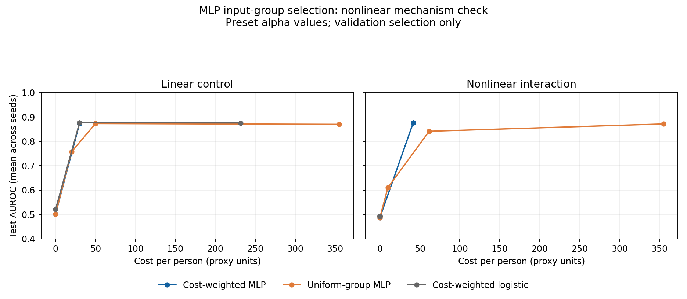

# MLP＋成本加权 Group Lasso：非线性机制实验

日期：2026-09-09。全部为合成数据和临时价格，不代表真实疾病效果或真实医疗收费。

## 模型与实验

主预测器为输入 20 → tanh 隐藏层 24 → sigmoid 输出的 MLP，各层参数一起训练。
付费检查对应第一层的完整输入连接块，按 Frobenius 范数组稀疏；整组精确为零时移除检查，无旁路和额外门控。
训练目标：平均 BCE + λ Σ_g w_g ‖W1[G_g,:]‖_F + ridge/2 × (‖W1‖_F² + ‖W2‖₂²)。
成本权重为 sqrt(组大小) × c_g / median(正价格)，普通组惩罚对照仅为 sqrt(组大小)。输入缩放只拟合训练集。
ridge=0.001，偏置不惩罚；全批量近端梯度和回溯步长。每次最多 1500 步，停止残差 1e-4。
各层权重均有 L2 正则，限制输入层缩小、后层放大的参数尺度补偿。MLP 是非凸问题，达到驻点也不是全局最优。

每任务 2400 条记录，种子 [51966, 51967, 51968]，按标签分层 60%/20%/20% 训练/验证/测试。
20 个独立标准正态特征；2 个免费特征和 6 个付费组各 3 个特征，价格 10、20、35、60、90、140，总价 355 proxy_unit。
线性对照的真实 logit 为 1.7×x2−1.3×x5；非线性任务为 4×x2×x5，再以 sigmoid 概率抽样标签。
两个任务的信号组均为 g0、g1（费用 30）。交互任务中单个信号特征没有总体边际关联，适合检验组合信号；生成机制仅用于审计，不供训练。
先从随机初始化训练全输入 MLP，再从同一全输入模型分别沿两类递增 λ 路径继续训练。这样避免从全零模型出发漏掉纯交互信号。
预设 λ 网格为 [0.0, 0.001, 0.003, 0.01, 0.03, 0.1]；α 网格为 [0.0, 0.0005, 0.001, 0.003, 0.01]。初始种子固定，沿路径承接上一 λ 的模型；这是机制设置，未做大规模架构或超参数搜索。
MLP 路径模型直接输出预测，不再改用 logistic 重拟合。免费/全检查 MLP 作为边界参照；logistic 也在相同数据上重新运行。
logistic 路径及免费/全检查 logistic 边界均使用 ridge=1e-3，控制正则系数设置。
费用通过训练权重影响参数和选组；实际账单仍按所选检查全价计。验证侧按 BCE+α×实际费用选择 λ/候选，测试只在全部选择完成后评价。
λ 是代理惩罚强度，α 是实际费用的评价权重，二者没有强行等同；没有费用上限。

## 结果

展示预设 α=0.001 及全输入/免费基线；不是按测试结果选择 α。完整均值、标准差见 summary.csv。

| 任务 | 方法 | 费用均值 | 测试 BCE | 测试 AUROC | 测试 AP |
| --- | --- | ---: | ---: | ---: | ---: |
| linear_control | logistic_all | 355.0 | 0.4479 | 0.8727 | 0.8792 |
| linear_control | logistic_cost_weighted | 30.0 | 0.4467 | 0.8766 | 0.8837 |
| linear_control | logistic_free | 0.0 | 0.6927 | 0.5207 | 0.5214 |
| linear_control | mlp_all | 355.0 | 1.0538 | 0.7702 | 0.7839 |
| linear_control | mlp_cost_weighted | 30.0 | 0.4484 | 0.8733 | 0.8805 |
| linear_control | mlp_free | 0.0 | 0.6947 | 0.5019 | 0.5175 |
| linear_control | mlp_uniform | 50.0 | 0.4537 | 0.8729 | 0.8800 |
| nonlinear_interaction | logistic_all | 355.0 | 0.6967 | 0.5233 | 0.5234 |
| nonlinear_interaction | logistic_cost_weighted | 0.0 | 0.6947 | 0.4929 | 0.5055 |
| nonlinear_interaction | logistic_free | 0.0 | 0.6947 | 0.4929 | 0.5055 |
| nonlinear_interaction | mlp_all | 355.0 | 0.9176 | 0.7632 | 0.7648 |
| nonlinear_interaction | mlp_cost_weighted | 41.7 | 0.4471 | 0.8759 | 0.8816 |
| nonlinear_interaction | mlp_free | 0.0 | 0.6986 | 0.4869 | 0.5036 |
| nonlinear_interaction | mlp_uniform | 61.7 | 0.5474 | 0.8414 | 0.8480 |



## 限制与复现

- 72 个 MLP 拟合中 3 个达到 1e-4 驻点残差阈值；其他拟合用满迭代次数，明确不标作收敛。
- 全输入 MLP 在本配置下出现明显过拟合，不能由非线性表达能力推出泛化必然更好；需同时检查独立测试表现和训练诊断。
- 目标下降轨迹、驻点残差、实际迭代数及各层参数全部保存，不能沿用 logistic 的凸优化保证。
- 未枚举所有 MLP 子集，也未证明选择的是最低实际费用方案。成本组范数只是代理，不能把其数值写成账单。
- 这轮同时检查非线性表达和价格权重影响，不预设成本权重必然优于普通组权重；只报告实际结果。
- 真实受试者数据、真实检查价格映射及重叠检查仍未接入。问题与数学定义文件不变。

```powershell
.venv/Scripts/python.exe -m run_experiment.run_group_lasso_mlp_pilot --output results/group_lasso_mlp_pilot_rerun --samples 2400 --hidden 24 --iterations 1500 --seeds 51966 51967 51968
```

synthetic_*.npz 保存生成数据；models_*.npz 保存全部模型、缩放参数和划分；traces_*.json 保存训练目标轨迹。
candidates.csv 仅含训练诊断和验证分数；selected.csv/summary.csv 含已冻结选择的测试结果；manifest.json 记录环境和代码哈希。

运行 `.venv/Scripts/python.exe -m run_experiment.verify_group_lasso_mlp_pilot results/group_lasso_mlp_pilot_20260909` 可独立复核所有候选的验证分数、选择后的测试分数、收费与输入不变性。

方法参考：[Feng & Simon, Sparse-Input Neural Networks](https://arxiv.org/abs/1711.07592)。本实现为检查级、价格加权的组惩罚原型，不声称提出新的神经网络特征选择方法。
