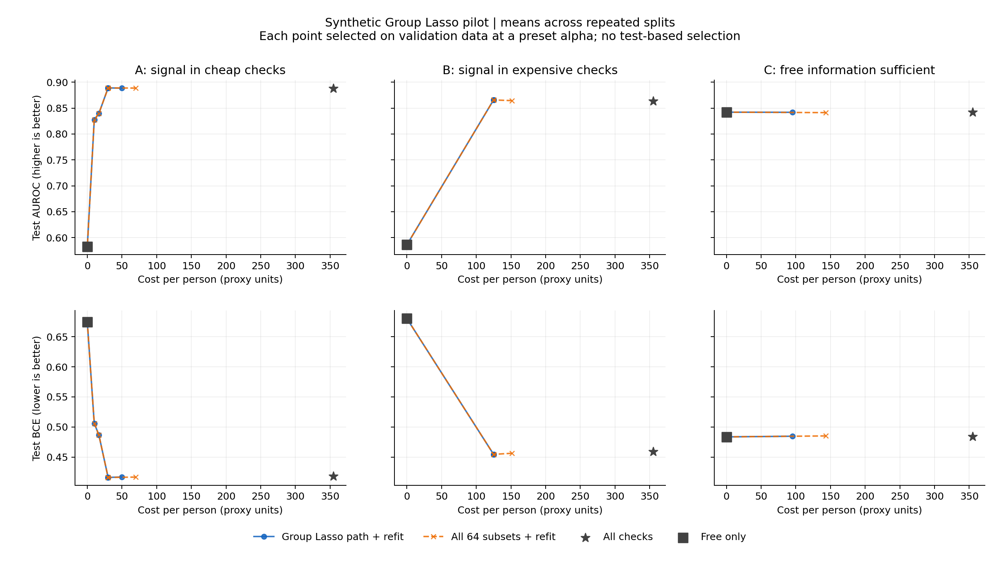

# Group Lasso 合成实验报告

本轮是合成数据、非重叠检查组及临时费用的机制实验，不是真实疾病或真实医疗价格结果。

## 实验设置

每个任务 3600 人；每次按类别分层划分 60% 训练、20% 验证、20% 测试。
随机种子：[51966, 51967, 51968]。这是重复留出实验，不是交叉验证或独立队列复现。

20 个特征：2 个免费基础特征、6 个付费检查各覆盖 3 个特征。检查价格依次为 10、20、35、60、90、140 proxy_unit，总价 355。
任务 A 的信号来自免费信息及 g0、g1（费用 30）；任务 B 来自免费信息及 g2、g4（费用 125）；任务 C 只来自免费信息。

Group Lasso 使用组权重 sqrt(组大小)、训练侧标准化、平均 BCE、固定 ridge=1e-4；截距不惩罚，基础信息不受组惩罚。
λ 从训练侧基础模型导出的 λ_max 的 1.05 倍到 0.005 倍，再加入 0。活动组容差为 1e-6。
路径支持集加上基础信息和全检查边界候选；各候选统一用训练数据重新拟合 ridge logistic 模型。费用仅参与验证方案选择，没有伪装成 Group Lasso 系数拟合时的实际账单。

预设 α 网格：[0.0, 0.00025, 0.0005, 0.001, 0.002, 0.005, 0.01, 0.02]。验证数据按 BCE + α×Cost 选方案，所有决定完成后才评估测试数据。α=0 是无费用偏好的消融。
枚举参照覆盖全部 64 套检查组合，使用完全相同的重拟合模型；它是有限候选内的验证最优参照，不是总体风险最优或真实疾病最优证明。

## 结果

下表均为重复实验的测试指标与费用均值；完整 α 网格及标准差见 summary.csv。仅展示预先设定网格的 0、0.001、0.005，不据测试成绩推荐 α。

| 任务 | 方法 | α | 费用 | 检查数 | 测试 BCE | 测试 AUROC | 测试 AP |
| --- | --- | ---: | ---: | ---: | ---: | ---: | ---: |
| A 便宜信号 | 全部检查 | — | 355.0 | 6.0 | 0.4182 | 0.8878 | 0.8589 |
| A 便宜信号 | 64 组合枚举 | 0 | 70.0 | 2.7 | 0.4166 | 0.8887 | 0.8604 |
| A 便宜信号 | 64 组合枚举 | 0.001 | 30.0 | 2.0 | 0.4161 | 0.8891 | 0.8607 |
| A 便宜信号 | 64 组合枚举 | 0.005 | 16.7 | 1.3 | 0.4867 | 0.8397 | 0.8010 |
| A 便宜信号 | 仅免费信息 | — | 0.0 | 0.0 | 0.6744 | 0.5824 | 0.5169 |
| A 便宜信号 | Group Lasso + 重拟合 | 0 | 50.0 | 2.3 | 0.4167 | 0.8885 | 0.8602 |
| A 便宜信号 | Group Lasso + 重拟合 | 0.001 | 30.0 | 2.0 | 0.4161 | 0.8891 | 0.8607 |
| A 便宜信号 | Group Lasso + 重拟合 | 0.005 | 16.7 | 1.3 | 0.4867 | 0.8397 | 0.8010 |
| B 较贵信号 | 全部检查 | — | 355.0 | 6.0 | 0.4587 | 0.8639 | 0.8456 |
| B 较贵信号 | 64 组合枚举 | 0 | 151.7 | 2.7 | 0.4562 | 0.8644 | 0.8477 |
| B 较贵信号 | 64 组合枚举 | 0.001 | 125.0 | 2.0 | 0.4544 | 0.8658 | 0.8493 |
| B 较贵信号 | 64 组合枚举 | 0.005 | 0.0 | 0.0 | 0.6802 | 0.5861 | 0.5218 |
| B 较贵信号 | 仅免费信息 | — | 0.0 | 0.0 | 0.6802 | 0.5861 | 0.5218 |
| B 较贵信号 | Group Lasso + 重拟合 | 0 | 125.0 | 2.0 | 0.4544 | 0.8658 | 0.8493 |
| B 较贵信号 | Group Lasso + 重拟合 | 0.001 | 125.0 | 2.0 | 0.4544 | 0.8658 | 0.8493 |
| B 较贵信号 | Group Lasso + 重拟合 | 0.005 | 0.0 | 0.0 | 0.6802 | 0.5861 | 0.5218 |
| C 免费信号 | 全部检查 | — | 355.0 | 6.0 | 0.4841 | 0.8421 | 0.8178 |
| C 免费信号 | 64 组合枚举 | 0 | 143.3 | 2.3 | 0.4850 | 0.8413 | 0.8176 |
| C 免费信号 | 64 组合枚举 | 0.001 | 0.0 | 0.0 | 0.4835 | 0.8422 | 0.8180 |
| C 免费信号 | 64 组合枚举 | 0.005 | 0.0 | 0.0 | 0.4835 | 0.8422 | 0.8180 |
| C 免费信号 | 仅免费信息 | — | 0.0 | 0.0 | 0.4835 | 0.8422 | 0.8180 |
| C 免费信号 | Group Lasso + 重拟合 | 0 | 95.0 | 1.3 | 0.4845 | 0.8419 | 0.8187 |
| C 免费信号 | Group Lasso + 重拟合 | 0.001 | 0.0 | 0.0 | 0.4835 | 0.8422 | 0.8180 |
| C 免费信号 | Group Lasso + 重拟合 | 0.005 | 0.0 | 0.0 | 0.4835 | 0.8422 | 0.8180 |



## 数值验证与适用范围

- 路径模型共 369 个，全部达到 KKT 残差 ≤1e-7；最大残差 9.99e-08。
- 与枚举参照在 72 个任务/种子/α 配置中有 67 个选择同一方案；路径的最大验证目标差为 0.002215。
- 有限 λ 路径可能漏掉有价值的组合；真实费用影响最终方案选择，不保证候选生成已经充分考虑价格。
- 本轮没有实现重叠 Group Lasso、真实数据字段映射或组门控。重叠收费只做独立的覆盖/计费逻辑测试，不作为重叠模型已实现的证据。
- 合成任务的关系是线性 logistic 生成；本轮不能回答非线性互补信号、真实疾病准确率或医院价格下的节省幅度。
- 数学定义文档保持不变。

## 复现与文件

从项目根目录运行；输出目录必须为空，下面使用新的目录以保留既有结果：

```powershell
.venv\Scripts\python.exe -m run_experiment.run_group_lasso_pilot --output results/group_lasso_pilot_20260907_rerun --samples 3600 --seeds 51966 51967 51968 --lambdas 40
```

- manifest.json：环境版本、配置和代码哈希。
- path.csv：λ 路径、活动检查组、KKT 与迭代次数。
- candidates.csv：全部 64 组合的验证得分；不包含全候选测试排名。
- selected.csv / summary.csv：已选方案的逐次结果、重复实验均值与标准差。
- models_*.npz：模型参数、训练侧缩放参数和样本划分。
- synthetic_*.npz：本轮合成数据及真实生成系数。
- cost_performance.png / .svg：独立可导出的结果图。
